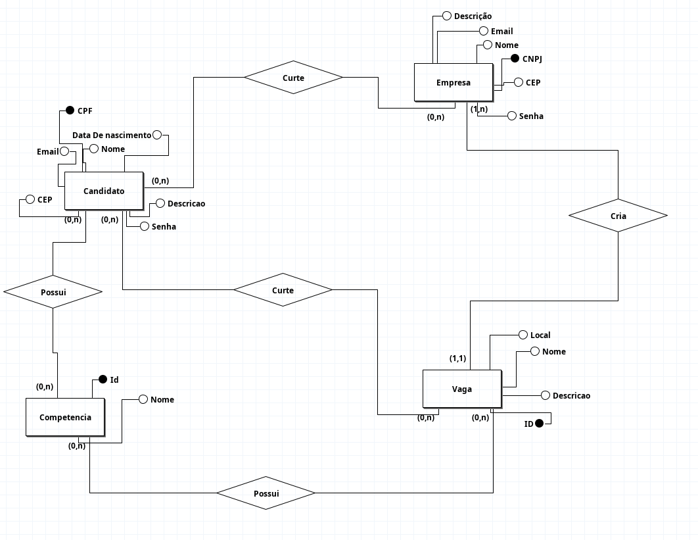

# Linketinder

Projeto desenvolvido em Groovy como MVP para o programa Acelera ZG.

## Autor
Matheus Rocha

## Como executar

### IntelliJ IDEA
1. Abra o projeto
2. Vá até `App.groovy`
3. Clique com o botão direito
4. Selecione **Run 'App.main()'**

### Terminal
Dentro da pasta do projeto:

Execute esse comando:
```bash
groovy src/com/theucsrocha/entities/App.groovy
```

❤️ Nova Feature: Sistema de Curtidas e Match

Foi implementado o sistema de curtidas no Linketinder.

Agora:

Um candidato pode curtir uma empresa.

Uma empresa pode curtir um candidato.

Quando ambos se curtem, ocorre um Match.

O Match indica que há interesse mútuo entre as duas partes, permitindo que avancem no processo.

Nova Feature: Adicionado a função de adicionar um novo candidato e empresa, acompanhado por testes unitatios do Spock.

Nova Feature: O app agora também permite cadastrar e listar vagas. O cadastro de vaga busca a empresa pelo `CNPJ`, então a empresa precisa já existir no banco. As competências informadas para candidatos e vagas também precisam estar previamente cadastradas na tabela `COMPETENCIA`.
Nova Feature: Agora o sistema é integrado ao banco de dados
### 📊 Modelo Entidade Relacionamento (DER)
Abaixo está a modelagem conceitual do banco de dados, desenvolvida utilizando a ferramenta **brModelo**.


